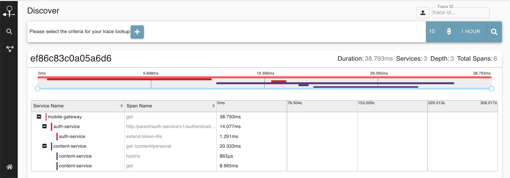
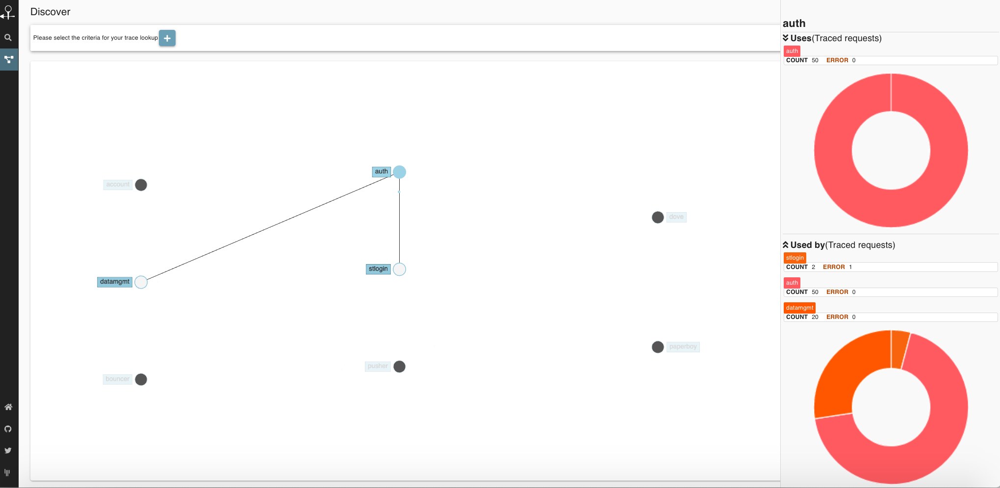

# Zipkin

## Introduction

[Zipkin][ZipkinGitHubUrl] is a distributed tracing system. It helps gather timing data needed to troubleshoot latency problems in service architectures. Features include both the collection and lookup of this data.

### Zipkin 能给我们提供什么

* 直观的调用链分析
    
    可以根据TraceId, Tags，时间段等来查询服务
* 系统间的依赖
    

### Zipkin 的架构是什么样子的

   

如上图：与其他Tracing系统一样， Zipkin服务端，有四个核心组件：

* **Collector**：收集器组件，它主要用于处理从外部系统发送过来的跟踪信息，将这些信息转换为zipkin内部处理的Span格式，以支持后续的存储、分析、展示等功能。

* **Storage**：存储组件，它主要对处理收集器接收到的跟踪信息，默认会将这些信息存储在内存中，我们也可以修改此存储策略，通过使用其他存储组件将跟踪信息存储到数据库中，目前支持的数据库有Mysql、Cassandra和Elasticsearch。

* **API**：API组件，提供给UI组件，展示跟踪信息。
* **UI**：UI组件，基于API组件实现的上层应用。通过UI组件用户可以方便而有直观地查询和分析跟踪信息。

## Reference

* [Zipkin 官网](https://zipkin.io/)

* [微服务架构 - SpringCloud整合分布式服务跟踪zipkin](https://www.cnblogs.com/atcloud/p/10606858.html)

* [Spring Cloud Sleuth + Zipkin 实现服务追踪](https://blog.51cto.com/zero01/2173394)
  
* [Zipkin 快速访问](https://segmentfault.com/a/1190000012342007?utm_source=tag-newest)
  
* [链路追踪工具Zipkin整合](https://www.jianshu.com/p/f177a5e2917f)

[ZipkinGitHubUrl]:https://github.com/openzipkin/zipkin
