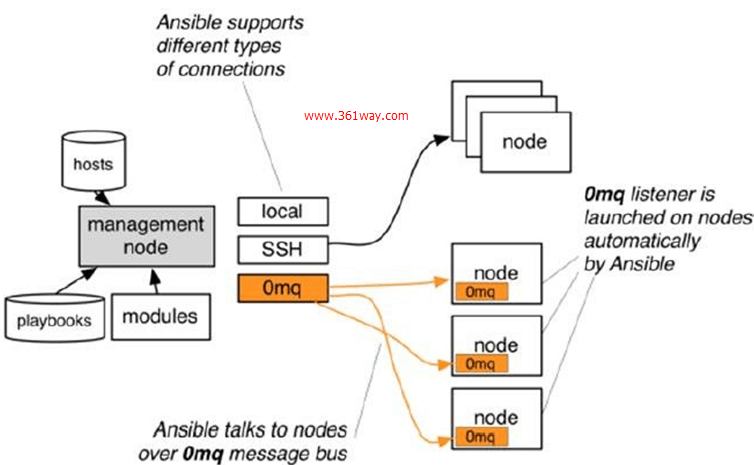

# Ansible 是什么？

ansible是一种自动化运维工具,基于paramiko开发的,并且基于模块化工作，Ansible是一种集成IT系统的配置管理、应用部署、执行特定任务的开源平台，它是基于python语言，由Paramiko和PyYAML两个关键模块构建。集合了众多运维工具的优点，实现了批量系统配置、批量程序部署、批量运行命令等功能.ansible是基于模块工作的,本身没有批量部署的能力.真正具有批量部署的是ansible所运行的模块，ansible只是提供一种框架.ansible不需要在远程主机上安装client/agents，因为它们是基于ssh来和远程主机通讯的.

ansible被定义为配置管理工具,配置管理工具通常具有以下功能:

* 确保所依赖的软件包已经被安装
* 配置文件包含正确的内容和正确的权限
* 相关服务被正确运行
# Ansible 和其她运维工具的比较
| 项目              | Puppet                                                | SaltStack                                | Ansible                                         |
|-----------------|-------------------------------------------------------|------------------------------------------|-------------------------------------------------|
| 开发语言            | Ruby                                                  | Python                                   | Python                                          |
| 是否有客户端          | 有                                                     | 有                                        | 无                                               |
| 是否支持二次开发        | 不支持                                                   | 支持                                       | 支持                                              |
| 服务器与远程机器是否相互验证  | 是                                                     | 是                                        | 是                                               |
| 服务器与远程机器的通信是否加密 | 是，标准的SSL协议                                            | 是，使用AES加密                                | 是，使用OpenSSH                                     |
| 平台支持            | AIX , BSD, HP\-UX, Linux , Mac OSX , Solaris, Windows | BSD, Linux , Mac OS X , Solaris, Windows | AIX , BSD , HP\-UX , Linux , Mac OS X , Solaris |
| 是否提供Web UI      | 提供                                                    | 提供                                       | 提供，但是是商业版本                                      |
| 配置文件格式          | Ruby 语法格式                                             | YAML                                     | YAML                                            |
| 命令行执行           | 不支持，大师可以通过配置模块实现                                      | 支持                                       | 支持                                              |
# Ansible 是什么样子的
## Ansible 有什么特点
部署简单, 只需要在控制主机上部署ansible环境,被控制端上只要求安装ssh和python 2.5以上版本,这个对于类unix系统来说相当与无需配置.

+ no angents: 被管控节点无需安装agent
+ no server: 无服务端,使用是直接调用命名
+ modules in any languages: 基于模块工作, 可以使用任意语言开发模块
+ 易读的语法: 基于yaml语法编写playbook
+ 基于推送模式: 不同于puppet的拉取模式,直接由调用者控制变更在服务器上发生的时间
+ 模块是幂等性的:定义的任务已存在则不会做任何事情,意味着在同一台服务器上多次执行同一个playbook是安全的
## 架构图

上图为ansible的基本架构，从上图可以了解到其由以下部分组成：

* **核心**：ansible
* **核心模块（Core Modules）**：这些都是ansible自带的模块
* **扩展模块（Custom Modules）**：如果核心模块不足以完成某种功能，可以添加扩展模块
* **插件（Plugins）**：完成模块功能的补充
* **剧本（Playbooks）**：ansible的任务配置文件，将多个任务定义在剧本中，由ansible自动执行
* **连接插件（Connectior Plugins）**：ansible基于连接插件连接到各个主机上，虽然ansible是使用ssh连接到各个主机的，但是它还支持其他的连接方法，所以需要有连接插件
* **主机群（Host Inventory）**：定义ansible管理的主机
## 原理图

以上是从网上找到的两张ansible工作原理图，两张图基本都是在架构图的基本上进行的拓展。从上面的图上可以了解到：

1、管理端支持local 、ssh、zeromq 三种方式连接被管理端，默认使用基于ssh的连接－－－这部分对应基本架构图中的连接模块；

2、可以按应用类型等方式进行Host Inventory（主机群）分类，管理节点通过各类模块实现相应的操作－－－单个模块，单条命令的批量执行，我们可以称之为ad-hoc；

3、管理节点可以通过playbooks 实现多个task的集合实现一类功能，如web服务的安装部署、数据库服务器的批量备份等。playbooks我们可以简单的理解为，系统通过组合多条ad-hoc操作的配置文件 。

## Ansbile 的结构
+ 配置文件: /etc/ansible/
+ 执行文件目录: /usr/bin/
+ lib依赖库: /usr/lib/python2.7/site-packages/ansible/
+ help文件: /usr/lib/python2.7/site-packages/ansible

## Ansible任务执行
### ansible任务执行模式
Ansible任务执行模式分为以下两种:

+ **ad-hoc模式(点对点模块)**
使用单个模块,支持批量执行单条命令,相当与在bash中执行一句shell命令
+ **playbook模式(剧本模式)**
ansible主要的管理方式,通过多个task的集合完成一类功能,可以理解为多个ad-hoc的配置文件

### ansible执行流程

