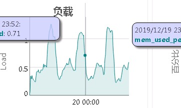

# 记Linux CPU Load过高问题跟踪

最近每天都会有cpu负载过高的短信报警搅扰大家的清梦。所以特地追踪分析一下，定位解决问题。

## 现象

### 系统环境

|环境|版本|备注|
|---|---|---
|操作系统| centos 7| |
|运行服务|telegraf, influxdb, 系统巡检程序| |
|系统配置|CPU 2核，内存8G，硬盘512| |

### 系统服务报警图

负载图如下：



整体系统的监控图如下：


以上两个图都平均值

现象奇怪的CPU，硬盘，内存IO，进程数，网络并没有像负载那样有规律的有尖峰起伏，需要深入系统中，进行分析

## 理解CPU load

参考[loadavg](loadavg.md)

## 分析

### 系统分析
由于loadavg 过高时间很短，所以为了能够及时观测到数值，写了个脚本，定时跑任务

```bash#!/usr/bin/env  bash

load1=$( cat /proc/loadavg|awk  '{print $1}')
logfile=/root/load.log


echo $(date) "load1="$load1 >> $logfile 


if [[ $(echo "$load1 >= 1"|bc) = 1 ]]; then
 echo "=========$(date) Top=============" >> $logfile
 top -b  -n 1 >>$logfile
 echo "=========$(date) cpu > 0=============" >> $logfile
 ps aux|head -1;ps aux|grep -v PID|awk  '{if ($3 > 0.0){print $0}}' >>$logfile
 PIDS=$(ps aux|grep -v PID|awk  '{if ($3 > 0.0){print $2}}')
 for PID in $PIDS 
 do
  echo "=========$(date) top $PID thread info =========" >> $logfile
  top -H -b -p $PID -n1 >>$logfile
  echo "=========$(date) ps $PID thread info =======" >> $logfile
   ps -Lp $PID cu >> $logfile
  echo "=========$(date) pidstat -p $PID -rutl =======" >> $logfile
   pidstat -p $PID -rutl  >> $logfile
 done
 echo "=========$(date) pidstat total =========" >> $logfile
  pidstat -trds >> $logfile
 echo "=========$(date) vmstat =========" >> $logfile
 vmstat 2 5 >> $logfile
 vmstat -s >> $logfile
 echo "=========$(date) iostat =========" >> $logfile
 iostat >> $logfile
 iostat -dx >>$logfile
 echo "=========$(date) netstat =========" >> $logfile
 netstat -ntlp >> $logfile
 echo "=======================sar =========" >> $logfile
  echo "=================sar process info =========" >> $logfile
  sar -P ALL 1 4 >> $logfile
  echo "=================sar network =============" >> $logfile
  sar -n ALL 1 1 >> $logfile
  echo "=================sar ALL =============" >> $logfile
  sar -A 1 1 >> $logfile
fi

```
当经过再次报警后分析，当时的磁盘，网络基本没什么流量， CPU也只有和平时一样的进程数量。所以要了解这个问题，但是报警是基本固定时间间隔，所以还是需要了解loadavg的机制，去结合自己的应用做响应的处理

### 分析linux内核机制

### 解决办法


## 解决办法

1. 减少同时运行的线程数

telegraf 具体的配置在/etc/telegraf/telegraf.conf。关于agent的配置如下

``` ini
[agent]
  interval = "10s"
  round_interval = true
  metric_batch_size = 1000
  metric_buffer_limit = 10000
  collection_jitter = "0s"
  flush_interval = "10s"
  flush_jitter = "0s"
  precision = ""
  debug = false
  quiet = false
  hostname = ""
  omit_hostname = false
```

把其中的 collection_jitter 修改为3s 这个参数，控制telegraf的线程启动的时候会随机sleep小于3s的值。这样基本可以控制同时运行的线程数

2. 升级CPU的核数，或者将telegraf的程序关于influxdb的现场抽离。

## 参考

1. [时间序列模型-移动平均数](https://blog.csdn.net/qq_29831163/article/details/89440215)
2. [serverfault: High load average but low CPU usage and disk I/O](https://serverfault.com/questions/949879/high-load-average-but-low-cpu-usage-and-disk-i-o)
3. [kernel org:cpuload](https://www.kernel.org/doc/html/latest/admin-guide/cpu-load.html)
4. [Investigation of regular high load on unused machines every 7 hours](https://blog.avast.com/investigation-of-regular-high-load-on-unused-machines-every-7-hours)
5. [Understanding why the Linux loadavg rises every 7 hours ](https://mackerel.io/blog/entry/tech/high-loadavg-every-7-hours)
6. [telegraf:high load average every 1h 45m ](https://github.com/influxdata/telegraf/issues/3465)
7. [UNIX Load Average Part 2: Not Your Average Average](https://www.helpsystems.com/resources/guides/unix-load-average-part-2-not-your-average-average)
8. [Understand Linux Load Averages and Monitor Performance of Linux](https://github.com/wmenjoy/awesome-knowleges/edit/master/os/linux/schedule/system_hign_problem.md)
9. [找到Linux虚机Load高的"元凶"](https://www.jianshu.com/p/3edc2c9f05e9)
10. [cpu load过高问题排查](https://www.cnblogs.com/lddbupt/p/5779655.html)
11. [CPU Load](https://segmentfault.com/a/1190000008322093)
